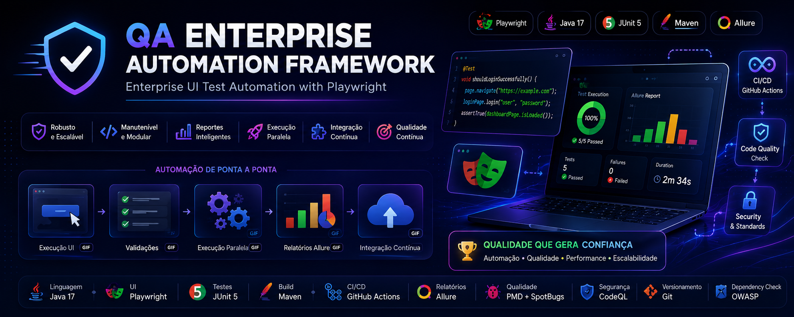
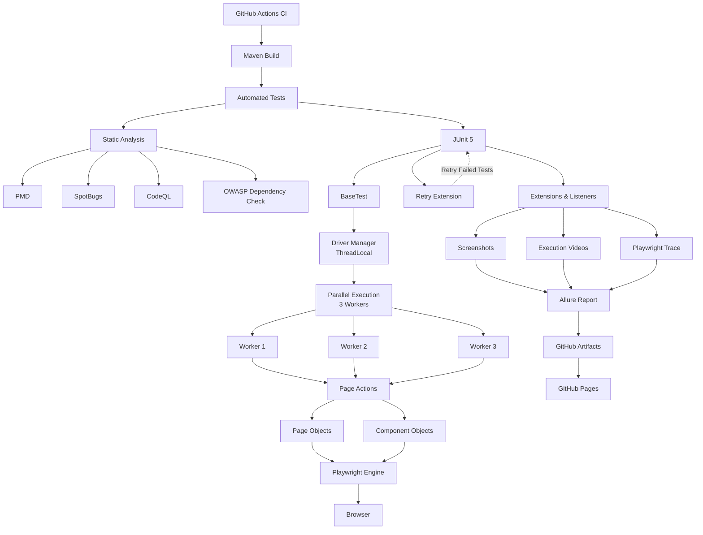

<p align="center">
  
</p>
<br>
<div align="center">

# QA Enterprise Automation Framework

**Automação de testes construída com a mentalidade de Engenharia de Software.**

<div align="center">


</div>

<div align="center">


</div>

### Framework de Automação de Testes UI desenvolvido com Playwright, Java e JUnit 5

Arquitetura corporativa para automação de testes com foco em qualidade, escalabilidade e integração contínua.

**Execução paralela • Retry automático • Evidências completas • CI/CD • Segurança • Arquitetura em camadas**

</div>

---

| Categoria | Tecnologia |
| -------------- | -------------- |
| ☕ Linguagem | Java 17 |
| 🎭 UI | Playwright |
| 🧪 Testes | JUnit 5 |
| 📦 Build | Maven |
| ⚙️ CI/CD | GitHub Actions |
| 📊 Relatórios | Allure |
| 🛡️ Segurança | CodeQL + Dependency Check |
| 🔍 Qualidade | PMD + SpotBugs |
| 🚀 Execução Paralela | Sim |
| 🌿 Versionamento | Git

---

# 📚 Índice

- [📖 Sobre o Projeto](#-sobre-o-projeto)
- [🚀 Por que este Framework?](#-por-que-este-framework)
- [🏗️ Arquitetura do Framework](#️-arquitetura-do-framework)
- [📂 Estrutura do Projeto](#-estrutura-do-projeto)
- [⭐ Principais Características](#-principais-características)
- [📖 Filosofia do Projeto](#-filosofia-do-projeto)
- [🏆 O que diferencia este projeto?](#-o-que-diferencia-este-projeto)
- [⚡ Como Executar](#-como-executar)
- [📊 Relatórios e Evidências](#-relatórios-e-evidências)
- [⚙️ Pipeline CI/CD](#️-pipeline-cicd)
- [🛡️ Qualidade e Segurança](#️-qualidade-e-segurança)
- [🗺️ Roadmap](#️-roadmap)
- [🤝 Contribuindo](#-contribuindo)
- [📄 Licença](#-licença)

---

# 📈 Status do Framework

| Item                    | Status |
| ----------------------- | :----: |
| Retry Automático        | ✅ |
| Screenshots Automáticos | ✅ |
| Vídeos da Execução      | ✅ |
| Playwright Trace        | ✅ |
| Arquitetura em Camadas | ✅ |
| Playwright | ✅ |
| Java 17 | ✅ |
| JUnit 5 | ✅ |
| Execução Paralela | ✅ |
| GitHub Actions | ✅ |
| Allure Reports | ✅ |
| PMD | ✅ |
| SpotBugs | ✅ |
| Dependency Check | ✅ |
| CodeQL | ✅ |
| Git Flow | ✅ |
| Docker | 🚧 |
| SonarQube | 🚧 |
| JaCoCo | 🚧 |

---

# 📖 Sobre o Projeto

Este framework foi desenvolvido para demonstrar como a automação de testes pode ser tratada como um projeto de Engenharia de Software, e não apenas como um conjunto de scripts automatizados.

Sua arquitetura foi construída com foco na separação de responsabilidades, reutilização de componentes e facilidade de evolução, permitindo que novas funcionalidades sejam incorporadas de forma organizada e sustentável.

Além da automação dos testes, o projeto integra ferramentas de análise de qualidade, segurança e geração de evidências, aproximando o fluxo de trabalho das práticas adotadas em ambientes corporativos.

---

# 🚀 Por que este Framework?

Este projeto foi desenvolvido para demonstrar como a automação de testes pode ser construída utilizando princípios modernos de Engenharia de Software.

Ao invés de concentrar toda a lógica diretamente nos testes, a arquitetura foi estruturada em camadas independentes, favorecendo organização, reutilização de código, facilidade de manutenção e evolução contínua.

Mais do que validar funcionalidades, este framework busca representar a forma como projetos corporativos são desenvolvidos, integrando automação de testes, qualidade de código, segurança e integração contínua em uma única solução.

---

# 🏗️ Arquitetura do Framework

Este framework foi projetado seguindo princípios de Engenharia de Software, adotando uma arquitetura modular e orientada à separação de responsabilidades. Cada camada possui uma função específica, permitindo maior reutilização, baixo acoplamento, facilidade de manutenção e evolução contínua.



> 💡 **Princípio da Arquitetura**

> Cada camada possui uma responsabilidade bem definida, permitindo que o framework evolua de forma independente, mantendo alta coesão, baixo acoplamento e maior escalabilidade.

---
# 📂 Estrutura do Projeto

```text
src
├── main
│
├── java
│   ├── actions
│   ├── components
│   ├── config
│   ├── constants
│   ├── drivers
│   ├── enums
│   ├── exceptions
│   ├── factories
│   ├── models
│   ├── pages
│   ├── utils
│   └── validations
│
└── test
    ├── assertions
    ├── base
    ├── extensions
    ├── listeners
    ├── retry
    ├── tests
    └── utils
```

A estrutura foi organizada para manter baixo acoplamento entre as camadas e facilitar a evolução do framework à medida que novas funcionalidades são adicionadas.

Cada camada possui uma responsabilidade única, tornando o framework mais organizado, reutilizável e preparado para projetos corporativos.


> 💡 **Organização do Projeto**

> A estrutura foi planejada para separar claramente código de produção, código de testes e componentes reutilizáveis, tornando a manutenção simples mesmo em projetos de grande porte.

---

# ⭐ Principais Características

- ✅ Arquitetura em camadas
- ✅ Page Object Model
- ✅ Component Object Model
- ✅ Execução paralela (3 threads)
- ✅ ThreadLocal Driver
- ✅ Retry automático para testes intermitentes
- ✅ Integração com GitHub Actions
- ✅ Allure Reports
- ✅ Screenshots automáticos em falhas
- ✅ Gravação de vídeos da execução
- ✅ Traces do Playwright
- ✅ PMD
- ✅ SpotBugs
- ✅ Dependency Check
- ✅ CodeQL
- ✅ Git Flow
- ✅ Maven
- ✅ JUnit 5
- ✅ Java 17

---

# 📖 Filosofia do Projeto

A qualidade de um framework não deve ser medida apenas pela quantidade de testes automatizados, mas pela capacidade de evoluir sem perder organização, legibilidade e confiabilidade.

Por esse motivo, este projeto foi desenvolvido seguindo princípios de Engenharia de Software, onde cada camada possui uma responsabilidade bem definida e cada decisão de arquitetura busca facilitar a manutenção e a expansão do framework ao longo do tempo.

O objetivo é demonstrar que automação de testes também deve ser construída com o mesmo cuidado dedicado ao desenvolvimento de software.

---

# 🏆 O que diferencia este projeto?

| Framework tradicional | QA Enterprise Automation Framework |
|-----------------------|------------------------------------|
| Scripts de automação | Arquitetura orientada a camadas |
| Código concentrado nos testes | Separação clara de responsabilidades |
| Pouca reutilização | Componentes reutilizáveis |
| Execução manual | Integração com GitHub Actions |
| Relatórios básicos | Allure Reports com evidências completas |
| Foco apenas na automação | Qualidade, segurança e CI/CD integrados |
| Crescimento limitado | Arquitetura preparada para evolução |

Em vez de apenas automatizar testes, este projeto busca representar a forma como equipes de engenharia constroem frameworks escaláveis, seguros e preparados para integração contínua.

Cada decisão arquitetural foi tomada com foco em reutilização, baixo acoplamento, manutenção, escalabilidade e evolução contínua.

---

# ⚡ Como Executar

## Pré-requisitos

Antes de executar o projeto, certifique-se de possuir instalado:

- Java 17 ou superior
- Maven 3.9+
- Git
- Navegadores suportados pelo Playwright

---

## Clonar o repositório

```bash
git clone https://github.com/fernandounbandeira060712/web-automation-framework-playwright.git
```

---

## Acessar o projeto

```bash
cd web-automation-framework-playwright
```

---

## Instalar as dependências

```bash
mvn clean install
```

---

## Executar os testes

O framework executa os testes utilizando **3 threads simultâneas**, reduzindo o tempo total de execução e garantindo isolamento entre os cenários por meio do uso de **ThreadLocal**.

```bash
mvn clean test
```

---

## Executar uma suíte específica

```bash
mvn test -Dtest=NomeDaClasseDeTeste
```

---

## Gerar o Allure Report

```bash
allure serve target/allure-results
```

---

# 📊 Relatórios e Evidências

Durante a execução dos testes, o framework gera automaticamente evidências completas por meio do Allure Report, facilitando a análise, reprodução e investigação de falhas.

### Evidências geradas automaticamente

- 📄 Dashboard completo no Allure Report
- 📸 Screenshot automático em caso de falha
- 🎥 Vídeo completo da execução do teste
- 📂 Playwright Trace para reprodução passo a passo
- 📑 Logs de execução
- ⏱️ Tempo de execução de cada cenário
- 📊 Histórico e status dos testes

Essa abordagem permite que toda falha seja analisada com riqueza de detalhes, reduzindo o tempo de investigação e aumentando a confiabilidade do processo de automação.

Esses artefatos permitem identificar rapidamente falhas, reproduzir cenários e facilitar a investigação de problemas durante a execução automatizada.

---

# ⚙️ Pipeline CI/CD

O projeto possui integração contínua utilizando GitHub Actions para validar automaticamente cada alteração enviada ao repositório.

A pipeline executa:

- ✅ Compilação do projeto
- ✅ Execução paralela dos testes
- ✅ Retry automático para testes elegíveis
- ✅ Geração do Allure Report
- ✅ PMD
- ✅ SpotBugs
- ✅ Dependency Check
- ✅ CodeQL Analysis

Esse fluxo garante que cada alteração passe por validações de qualidade, segurança e execução automatizada antes de ser considerada estável.

---

## 🔄 Fluxo Automatizado de Integração

O projeto utiliza GitHub Actions e Dependabot para automatizar validações, segurança e manutenção das dependências.

### Fluxo de desenvolvimento

```text
Desenvolvimento (dev)
        │
        ▼
 Commit + Push
        │
        ▼
 Pull Request
        │
        ▼
 GitHub Actions
        │
        ├── Maven Build
        ├── Automated Tests
        ├── Retry
        ├── PMD
        ├── SpotBugs
        ├── Dependency Review
        ├── OWASP Dependency Check
        ├── CodeQLCodeQL Analysis
        ├── Allure Report
        └── Playwright Artifacts
        │
        ▼
Code Review
        │
        ▼
Merge
        │
        ▼
Main
        │
        ▼
Publish Allure Report
```

### Automações disponíveis

| Automação | Comportamento |
|------------|---------------|
| GitHub Actions | Executa automaticamente as validações em Pull Requests direcionados à `main` |
| Validação pós-merge | Executa novamente a pipeline após alterações integradas à `main` |
| Dependabot Version Updates | Verifica periodicamente novas versões das dependências Maven |
| Dependabot GitHub Actions | Verifica periodicamente atualizações das actions utilizadas nos workflows |
| Pull Requests do Dependabot | Cria automaticamente PRs quando encontra atualizações disponíveis |
| Dependency Review | Analisa alterações de dependências introduzidas por Pull Requests |
| CodeQL | Realiza análise estática de segurança |
| OWASP Dependency Check | Identifica vulnerabilidades conhecidas nas bibliotecas |
| Allure Report | Consolida resultados, tempos de execução e evidências |
| GitHub Pages Deployment | Publica o relatório Allure após execução na branch `main` |
| GitHub Notifications | O GitHub pode notificar falhas da pipeline conforme as preferências do usuário |

> ℹ️ O envio de commits para a branch `dev` não cria automaticamente um Pull Request. O PR para a branch `main` deve ser aberto pelo responsável pela alteração.

---

# 🛡️ Qualidade e Segurança

Além da automação de testes, o framework incorpora ferramentas de qualidade e segurança utilizadas em projetos corporativos.

| Ferramenta | Finalidade |
|------------|------------|
| PMD | Identificação de problemas de qualidade de código |
| SpotBugs | Detecção de possíveis bugs |
| Dependency Check | Identificação de vulnerabilidades em dependências |
| CodeQL | Análise estática de segurança |
| GitHub Actions | Integração contínua |

Essas verificações são executadas automaticamente durante a pipeline, contribuindo para manter elevados padrões de qualidade e segurança.

---

# 🗺️ Roadmap

## ✅ Concluído

- ✅ Arquitetura em Camadas
- ✅ Java 17
- ✅ Playwright
- ✅ JUnit 5
- ✅ Maven
- ✅ Page Object Model (POM)
- ✅ Component Object Model (COM)
- ✅ BaseTest
- ✅ ThreadLocal Driver Manager
- ✅ Execução Paralela (3 Workers)
- ✅ Retry Automático
- ✅ Listeners e Extensions
- ✅ Git Flow
- ✅ GitHub Actions CI
- ✅ Allure Reports
- ✅ Screenshots Automáticos
- ✅ Vídeos da Execução
- ✅ Playwright Trace
- ✅ GitHub Artifacts
- ✅ GitHub Pages Deployment
- ✅ PMD
- ✅ SpotBugs
- ✅ OWASP Dependency Check
- ✅ CodeQL

---

## 🚀 Próximas Evoluções

- 🚧 SonarQube Cloud
- 🚧 JaCoCo Code Coverage
- ⏳ Docker Support
- ⏳ TestContainers
- ⏳ Selenium Grid
- ⏳ Remote Execution
- ⏳ BrowserStack Integration
- ⏳ Azure DevOps Pipeline
- ⏳ Cross-Browser Matrix Execution
- ⏳ Slack / Microsoft Teams Notifications
  
---

# 🤝 Contribuindo

Contribuições são bem-vindas.

Caso identifique melhorias ou deseje adicionar novas funcionalidades, fique à vontade para abrir uma Issue ou enviar um Pull Request.

Toda contribuição será analisada com atenção.

---

# 📄 Licença

Este projeto está licenciado sob a licença MIT.

Sinta-se livre para estudar, utilizar e adaptar este framework para fins educacionais ou profissionais.
